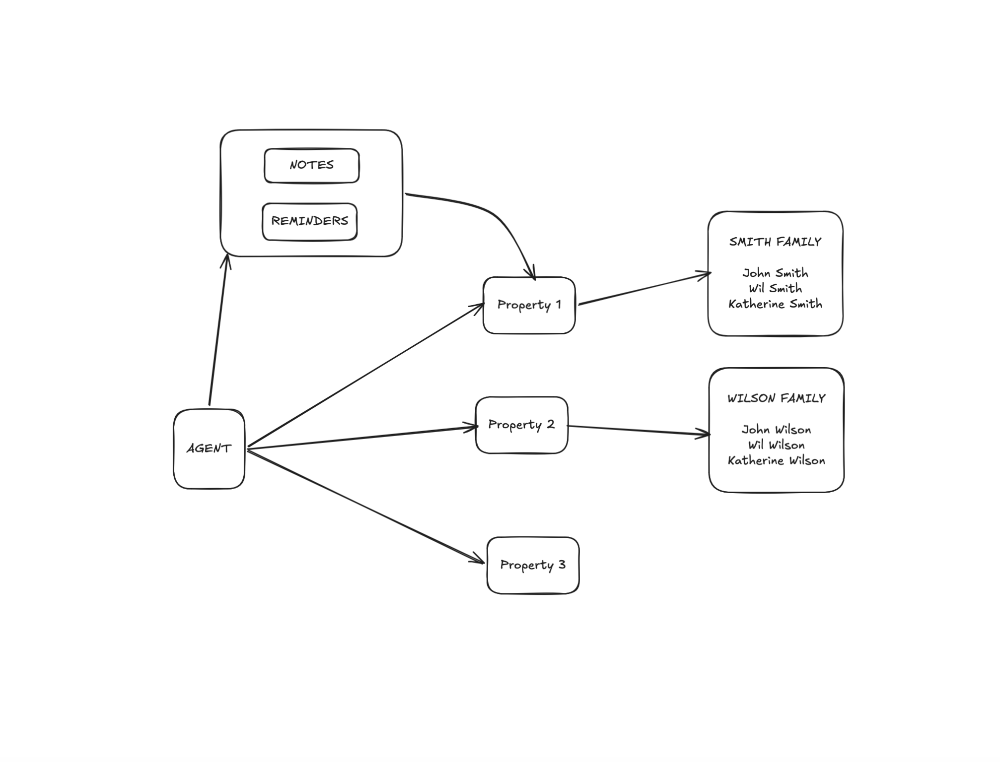
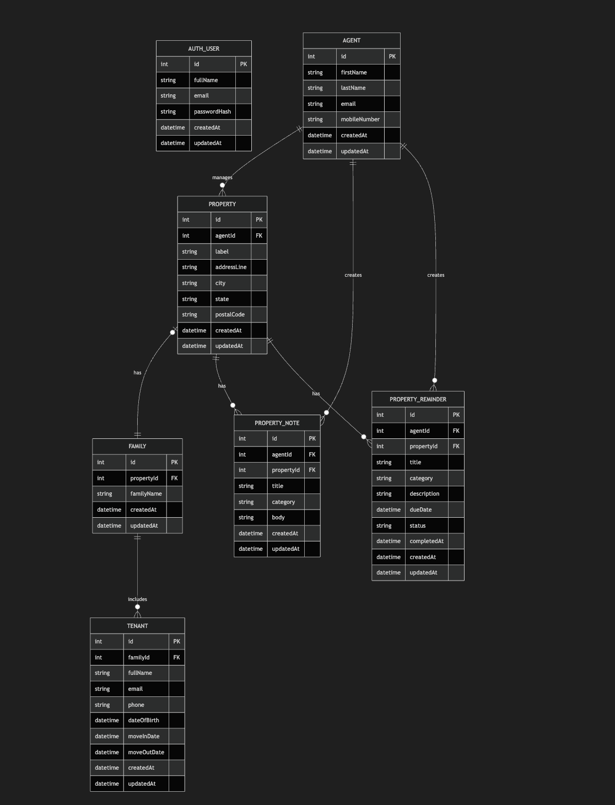

# Property Agent Backend

A Node.js + TypeScript backend for managing property agents, rental properties, family-based tenants, property notes, and reminders.

## Stack

- Express for HTTP APIs
- In-memory store for runtime data
- Zod for request validation

## Domain Model

The system models the assignment rules directly:

- One agent manages many properties.
- One property has one family household.
- One family has one or more tenants.
- One agent creates notes and reminders for a property.

See [docs/data-model.md](docs/data-model.md) for the relational design.

See [docs/error-handling.md](docs/error-handling.md) for frontend vs backend error-handling responsibilities.

## Run Locally

```bash
npm install
npm run dev
```

The API starts on `http://localhost:3000` by default.

Swagger UI is available at `http://localhost:3000/docs`.

## Authentication

Most API endpoints under `/api` are private and require a Bearer token.

- `POST /auth/register` creates a user and returns a token.
- `POST /auth/login` returns a token for an existing user.
- `GET /auth/me` validates a token and returns the logged-in user.

The server starts with in-memory sample data, including a default login account:

- Email: `admin@pureagent.local`
- Password: `Admin@12345`

## API Labels

- `POST /auth/register`
- `POST /auth/login`
- `GET /auth/me`
- `GET /health`
- `GET /api/agents`
- `POST /api/agents`
- `GET /api/agents/:agentId`
- `DELETE /api/agents/:agentId`
- `GET /api/properties`
- `POST /api/properties`
- `GET /api/properties/:propertyId`
- `POST /api/properties/:propertyId/family`
- `POST /api/families/:familyId/tenants`
- `POST /api/properties/:propertyId/notes`
- `POST /api/properties/:propertyId/reminders`
- `PATCH /api/reminders/:reminderId/status`

Private endpoints under `/api` require the header:

- `Authorization: Bearer <token>`

## Diagram

<p align="center">
  
</p>


